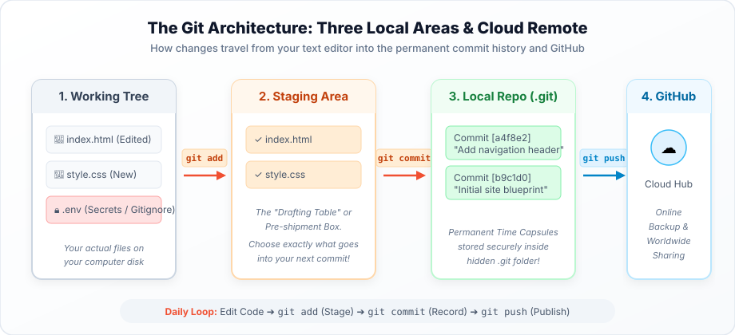

# Chapter 2: How Git Works Under the Hood ⚙️📦

---

## 1. 🌟 Real-Life Situation: Preparing a Parcel for Shipment

Imagine preparing a package to send to a cousin in Jammu or Delhi:

1. **Your Bedroom Desk (Working Directory)**:
   - You have gifts, books, sweets, and wrapping paper spread across your desk.
   - You are still testing, cutting, and arranging things. Nothing is final yet.
2. **The Cardboard Shipping Box (Staging Area / Index)**:
   - You don't dump your entire messy desk into the parcel!
   - You carefully pick up the book and the hand-written letter and place them inside the box.
   - You have chosen *specifically* what is ready to be sent.
3. **Sealing and Stamping with Wax (Local Repository)**:
   - You tape the box shut, stick a formal shipping label with a unique tracking number, and deposit it into your family archives.
   - Once sealed, that parcel is a permanent historical package that cannot be tampered with.
4. **The Courier Van (Remote / GitHub)**:
   - The courier collects your sealed parcel and delivers a synchronized copy to the central depot online so family members anywhere can access it!

**Git works using these exact same distinct stages!**

---

## 2. 🎯 Learning Objectives

By the end of this chapter, you will be able to:
- Identify and describe the **Three Local Trees of Git**: Working Directory, Staging Area, and Local Repository.
- Understand the role of the **Staging Area** as a pre-commit review station.
- Explain why Git does not automatically commit every modified file.
- Understand the relationship between your local machine and remote platforms like GitHub.
- Trace the complete journey of code from editor to cloud.

---

## 3. 👁️ Visual Concept Explanation

### The Three Local Trees & Cloud Remote Architecture



```text
+-------------------+      git add       +-------------------+     git commit     +-------------------+     git push     +-------------------+
| 1. WORKING TREE   | -----------------> |  2. STAGING AREA  | -----------------> | 3. LOCAL REPO     | ---------------> | 4. GITHUB CLOUD   |
| (Your active files|                    | (Selected files   |                    | (Permanent .git   |                  | (Remote backup &  |
|  in VS Code)      |                    |  ready to record) |                    |  commit history)  |                  |  collaboration)   |
+-------------------+                    +-------------------+                    +-------------------+                  +-------------------+
```

---

## 4. 💻 Code Example: Watching Files Move Across the 3 Trees

Let's see this in action using terminal commands:

```bash
# 1. Check current status (Git inspects the Working Tree)
git status

# 2. Add an updated file from Working Tree to the Staging Area
git add index.html

# 3. Check status again: notice index.html is now green (Staged!)
git status

# 4. Seal the staged files into a permanent commit in Local Repo
git commit -m "feat: Add welcome banner to home page"

# 5. Push the commit to GitHub so teammates can see it
git push origin main
```

---

## 5. 🔍 Code Explanation: Why Do We Need the Staging Area?

Beginners often ask: *"Why does Git make me run `git add` before `git commit`? Why can't I just commit immediately?"*

### The Power of Intentional Commits:
Imagine you worked on two different tasks this afternoon:
1. You designed a brand-new **Navbar** in `navbar.html`.
2. While testing, you noticed a spelling error in `about.html` and fixed it.

Because of the **Staging Area**:
- You can stage ONLY `navbar.html` and commit: `"Add responsive navigation bar"`.
- Then stage `about.html` and commit: `"Fix spelling mistake in principal bio"`.

Your history stays clean, modular, and easy for other developers to review!

---

## 6. 🌍 Real-World Connection: The Hidden `.git` Folder

When you initialize a project with Git, it creates a hidden folder named `.git`:
- Everything that Git knows—all historical commits, branch pointers, remote addresses, and staging indexes—is stored inside `.git`.
- If you copy your project folder without `.git`, you lose all history.
- If you keep `.git`, you can delete all visible files on your desktop and restore them completely in 2 seconds!

---

## 7. ⚠️ Common Beginner Traps

1. **Running `git commit` without running `git add` first**:
   - *Error*: `nothing added to commit but untracked files present`.
   - *Fix*: You must tell Git which files to put into the staging box using `git add` first!
2. **Deleting the `.git` directory**:
   - *Mistake*: Thinking `.git` is useless junk and putting it in the Recycle Bin.
   - *Consequence*: Your project instantly ceases to be a Git repository!

---

## 8. 🔮 Predict the Output

A developer modifies two files: `contact.html` and `secrets.env`.
They run:

```bash
git add contact.html
git commit -m "Update office phone number"
```

**Question**: Is `secrets.env` included in the new commit?

<details>
<summary>👀 Click to check your answer</summary>
<strong>Answer:</strong> No! Because <code>secrets.env</code> was never added to the Staging Area, it remains safely untracked in the Working Tree!
</details>

---

## 9. 🕵️ Code Detective: The Red and Green Files

A student types `git status` and sees:

```text
Changes to be committed:
  (use "git restore --staged <file>..." to unstage)
	modified:   index.html

Untracked files:
  (use "git add <file>..." to include in what will be committed)
	logo.png
```

- **What does green `index.html` mean?** It is sitting in the **Staging Area**, ready to be committed!
- **What does red `logo.png` mean?** It is in the **Working Directory**, but Git has not been told to track or stage it yet!

---

## 10. 🏆 5 Levels of Mastery Exercises

### 🟢 Level 1: Recall
1. Name the three local areas of Git in sequential order.
2. What terminal command moves a modified file from the Working Directory into the Staging Area?
3. In which hidden folder does Git store its commit database?

### 🟡 Level 2: Understand
4. Explain the difference between `git add` and `git commit` using your own real-world analogy.
5. Why is having a staging area safer than auto-saving everything directly to the repository?

### 🟠 Level 3: Apply
6. Draw a diagram of your computer showing where `app.js`, the Staging Area, and `.git` live. Trace a line showing how `git add app.js` updates the staging index.

### 🔵 Level 4: Think & Troubleshoot
7. If you edit a file, run `git add file.html`, and then edit `file.html` AGAIN before committing, what will `git status` show? (Hint: The file will appear in BOTH staged and unstaged sections!).

### 🟣 Level 5: Create & Build
8. Write a clear guideline for your coding club explaining why we must never commit secret passwords or private student data (*Amānah*) to any Git stage.
