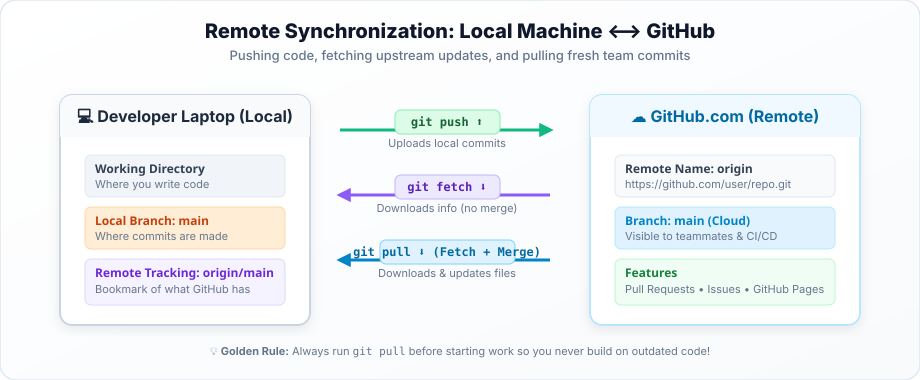

# Chapter 14: Connecting to Remotes & Pushing Code (`remote`, `push`) 🚀📡

---

## 1. 🌟 Real-Life Situation: Launching a Satellite to Orbit

Imagine building a weather-monitoring drone in Srinagar:
- You assemble the drone in your garage and calibrate its sensors locally.
- Once it is built, you configure its wireless antenna to point to the central satellite receiver on Hari Parbat or Shankaracharya Hill.
- When you press **Transmit**, all the temperature and air quality data recorded locally beams up to the cloud server where the entire community can see the forecast!

In Git:
- **`git remote add`** is programming your antenna to point to your GitHub repository address.
- **`git push`** is transmitting your local commits up into orbit!

---

## 2. 🎯 Learning Objectives

By the end of this chapter, you will be able to:
- Connect a local repository to a remote GitHub repository using `git remote add`.
- Inspect configured remotes using `git remote -v`.
- Push local commits to GitHub using `git push -u origin main`.
- Understand what `origin` and `-u` (upstream tracking) mean.
- Verify your uploaded files and commit messages on the GitHub web interface.

---

## 3. 👁️ Visual Concept Explanation

### The Remote Connection Workflow



```text
[ Developer Laptop ]                                         [ GitHub Cloud ]
  Local Branch: main                                            Remote Branch: main
       │                                                               ▲
       └───( git remote add origin git@github.com:... )────────────────┤  (Antenna Linked!)
       │                                                               │
       └───( git push -u origin main )─────────────────────────────────┘  (Commits Uploaded!)
```

---

## 4. 💻 Code Example: Linking and Pushing Your First Project

### 1. Create an Empty Repository on GitHub
1. Open [github.com/new](https://github.com/new).
2. Name your repo: `srinagar-eco-club`.
3. Choose **Public**.
4. **IMPORTANT**: Leave *"Add a README"*, *"Add .gitignore"*, and *"Choose a license"* **UNCHECKED** (since we already have local files!).
5. Click **Create repository**.

### 2. Connect and Push from Your Terminal
Copy the SSH or HTTPS address shown on GitHub and run:

```bash
# 1. Link your local project to the GitHub remote address
git remote add origin git@github.com:myasirdotin/srinagar-eco-club.git

# 2. Verify that the link was registered
git remote -v
# Output:
# origin  git@github.com:myasirdotin/srinagar-eco-club.git (fetch)
# origin  git@github.com:myasirdotin/srinagar-eco-club.git (push)

# 3. Push your commits and establish upstream tracking (-u)
git push -u origin main

# Output:
# Enumerating objects: 6, done.
# Counting objects: 100% (6/6), done.
# Writing objects: 100% (6/6), 1.25 KiB | 1.25 MiB/s, done.
# To github.com:myasirdotin/srinagar-eco-club.git
#  * [new branch]      main -> main
# branch 'main' set up to track 'origin/main'.
```

Refresh your browser on GitHub: **All your files and commit history are live! 🚀**

---

## 5. 🔍 Code Explanation: Breaking It Down

- `origin`: The standard, conventional nickname given to your primary remote repository on GitHub. You could technically name it anything, but 99.9% of programmers across the world call it `origin`.
- `git remote -v`: The `-v` flag stands for **verbose**; it prints the actual web/SSH URLs for fetching and pushing.
- `-u` (or `--set-upstream`):
  - Tells Git to bind your local `main` branch to the remote `origin/main` branch.
  - You only need to type `-u origin main` on your **first push**!
  - For all future pushes on that branch, you simply type: **`git push`**!

---

## 6. 🌍 Real-World Connection: Distributed Backups

Because Git is a distributed version control system:
- Your local computer has the complete repository history.
- GitHub has the complete repository history.
- If your laptop falls into Dal Lake, you lose zero code! You just buy a new computer, log in to GitHub, and download your entire project and its full history in 30 seconds!

---

## 7. ⚠️ Common Beginner Traps

1. **Creating the repo on GitHub with a README and then trying to push an existing local repo**:
   - Both histories will conflict!
   - *Fix*: When pushing an existing project, always create the GitHub repo completely empty (no README, no license).
2. **Mistyping the remote URL**:
   - If you made a typo, you don't have to restart! Just fix it:
   - `git remote set-url origin <correct-url>`

---

## 8. 🔮 Predict the Output

After running `git push -u origin main` once, you make a new commit.
You type simply:
```bash
git push
```

**Question**: Will Git know where to send the code, or will it complain?

<details>
<summary>👀 Click to check your answer</summary>
<strong>Answer:</strong> It will push smoothly! Because the <code>-u</code> flag established upstream tracking, Git remembers that your local <code>main</code> branch connects directly to <code>origin/main</code>!
</details>

---

## 9. 🕵️ Code Detective: The Remote Origin Exists Error

A student ran: `git remote add origin ...` and Git complained:
`error: remote origin already exists.`

- **Why?** The student had already linked an origin earlier.
- **How to verify**: Run `git remote -v` to see what is already set.
- **How to update**: Run `git remote set-url origin <new-url>`.

---

## 10. 🏆 5 Levels of Mastery Exercises

### 🟢 Level 1: Recall
1. What command links a local repository to a remote GitHub URL?
2. What is the default conventional nickname for a remote repository?
3. What does the `-u` flag stand for in `git push -u origin main`?

### 🟡 Level 2: Understand
4. Why is having a remote backup on GitHub safer than storing code only on a flash drive?
5. What does the `git remote -v` command show?

### 🟠 Level 3: Apply
6. Create an empty repository on your GitHub account, link an existing local practice project using `git remote add origin`, and push your code with `git push -u origin main`.

### 🔵 Level 4: Think & Troubleshoot
7. How do you push a local feature branch named `feature/footer` to GitHub so a teammate can review it? (Hint: `git push -u origin feature/footer`).

### 🟣 Level 5: Create & Build
8. Create a public GitHub showcase repository containing your HTML and CSS practice exercises, write a clean `README.md` introducing yourself from Srinagar, and share the repository link with a peer!
