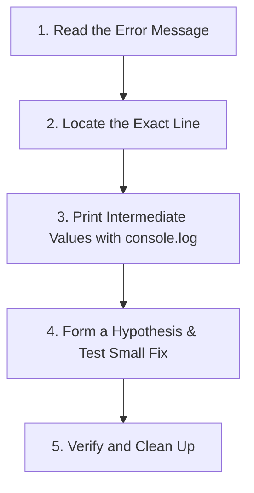

# Part 12: Debugging
# The Junior Developer's Debugging Playbook 🐞

---

## 1. Why Bugs Happen (And Why That's Completely Normal!) ❤️

In 1947, computer pioneer **Grace Hopper** found an actual moth trapped inside a relay of the Harvard Mark II computer that was causing calculation errors. She taped the moth into her logbook with the note: *"First actual case of bug being found."*

Every programmer—whether they have been coding for 2 weeks or 20 years at Google—encounters bugs every single day.
**A bug is not a failure; it is simply a puzzle waiting for you to solve it!**

---

## 2. The 3 Types of Programming Errors 🚨

To fix a bug quickly, you first need to know what kind of error it is:

### 1. Syntax Errors (Grammar Mistakes)
JavaScript cannot read or parse your code because rules were broken (missing closing bracket, misspelled keyword, missing quote).
- *Example:* `let greeting = "Hello World;` (unclosed quote)
- *What happens:* Code won't even start running!
- *Console says:* `SyntaxError: Unexpected identifier`

### 2. Runtime Errors (Crashes While Running)
Your code grammar is valid, but an illegal operation was attempted while running.
- *Example:* Calling a function on something that is `null` or `undefined`.
  ```javascript
  let user = null;
  console.log(user.name);
  ```
- *What happens:* The program runs until that exact line, then halts.
- *Console says:* `TypeError: Cannot read properties of null (reading 'name')`

### 3. Logic Errors (The Sneaky Ones!)
The code runs smoothly from start to finish with zero red error messages, but it produces the **wrong answer**!
- *Example:*
  ```javascript
  function calculateAverage(a, b) {
      return a + b / 2; // Math bug! Should be (a + b) / 2
  }
  ```
- *Console says:* Nothing! JavaScript thinks everything is fine. You must spot the math order of operations issue.

---

## 3. The 5-Step Debugging Method 🔍

Follow this systematic checklist whenever your code doesn't work:



### Step 1: Read the Error Message
Don't panic and close the console! Red error messages are your friend: they tell you:
- **What went wrong:** `ReferenceError: score is not defined`
- **Where it happened:** `script.js:24` (Line 24!)

### Step 2: Inspect Line 24 (and Line 23!)
Look right at the line reported in the console. If the line looks correct, look at the line **directly above it**—a missing bracket or semicolon on the previous line often triggers an error on the next line!

### Step 3: Use `console.log()` Detective Work
Print your variables at every step of the journey:
```javascript
console.log("DEBUG: input was ->", userInput);
let result = computeScore(userInput);
console.log("DEBUG: output is ->", result);
```

### Step 4: The Rubber Duck Technique 🦆
Software engineers keep a yellow rubber duck on their desks. When stuck:
1. Explain the problem out loud to the rubber duck (or a classmate).
2. Explain what every single line of code is supposed to do.
3. In 80% of cases, while explaining it out loud, your brain will suddenly say: *"Wait! I never updated the counter variable!"*

---

## 4. Top 10 Most Common JavaScript Bugs for Beginners 🏆

| Bug | What it looks like | How to fix |
|---|---|---|
| 1. Misspelled Variable | `let score = 10; console.log(Score);` | JS is case-sensitive! Check capitalization. |
| 2. Unclosed Strings | `let name = "Alex;` | Match your double, single, or backtick quotes. |
| 3. Single `=` in Conditions | `if (x = 5)` | Use `===` for comparisons! Single `=` assigns values. |
| 4. Off-By-One Array Index | `array[array.length]` | Last item is `array.length - 1`! |
| 5. String + Number Confusion | `"10" + 5 = "105"` | Use `Number("10") + 5 = 15`. |
| 6. Missing Closing `}` | Unmatched braces in functions or loops | Indent properly to align opening & closing braces. |
| 7. Accessing Property on Null | `document.getElementById("btn").click` | Did the ID match your HTML exactly? Is the script loaded at the bottom? |
| 8. Infinite Loop | `while (count < 10) {}` | Make sure `count++` is inside the loop! |
| 9. Variable Scope Error | Accessing function-local `let` outside | Return the value or declare in parent scope. |
| 10. Forgetting `return` | Function outputs `undefined` | Make sure your function explicitly calls `return`. |

---

## 5. Hands-On Debugging Clinic 🧪

Fix the bugs in these 3 broken programs:

### Case 1: The Broken Age Gate
```javascript
let userAge = 14;
if (userAge = 18) {
    console.log("You may enter!");
} else {
    console.log("Too young!");
}
```
*Why does it always print "You may enter!" even when userAge is 14?*

### Case 2: The Silent Loop
```javascript
let countdown = 5;
while (countdown > 0) {
    console.log("T-minus: " + countdown);
    // Oops!
}
```
*What happens if you run this? How do you fix the browser freeze?*

### Case 3: The Missing Total
```javascript
function addBonus(score) {
    let final = score + 50;
}

let myFinalScore = addBonus(100);
console.log("Score is: " + myFinalScore); // Prints "Score is: undefined"
```
*What one keyword is missing inside `addBonus`?*

---

## 6. Summary Checklist ✅

- [ ] I always open DevTools Console to read error messages and line numbers.
- [ ] I use `console.log()` to check variable states when math goes wrong.
- [ ] I verify casing on all variable names.
- [ ] I explain my code out loud when a bug refuses to show itself.
